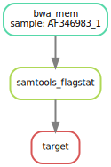
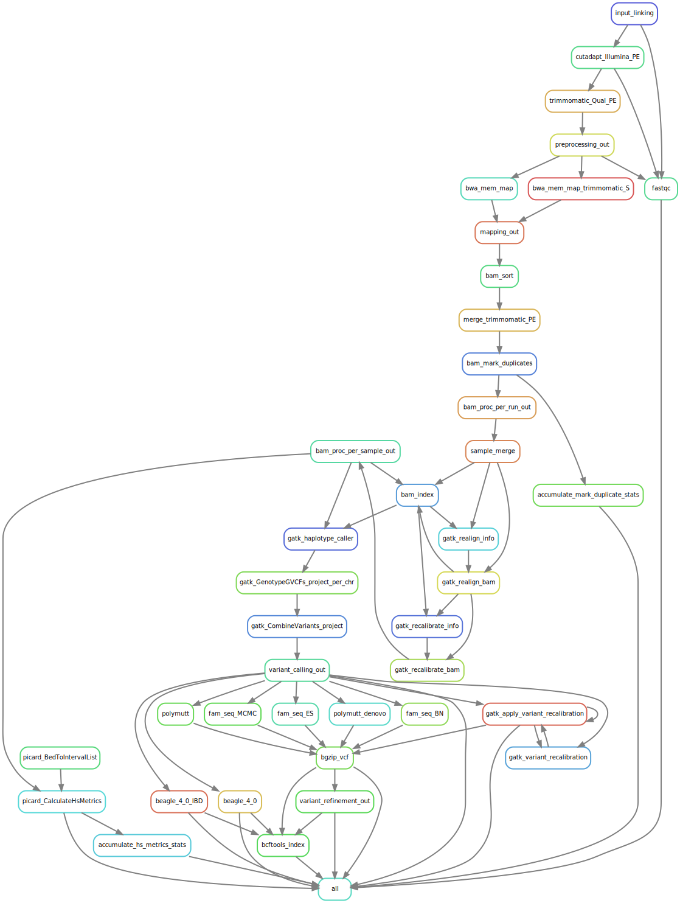

<style>
  #margin-15-percent > p {
    margin-top: 15%;
  }
  #margin-10-percent > p {
    margin-top: 10%;
  }
  #margin-5-percent > p {
    margin-top: 5%
  }
  #margin-0-percent > p {
    margin-top: 0%
  }
  #margin-minus5-percent > h3 {
    margin-top: -5%;
  }
</style>

## Get the slides: | https://github.com/dlaehnemann/TutMinicondaSnakemake

```{bash, eval=FALSE}
cd YourFavoriteTutorialFolder
git clone https://github.com/dlaehnemann/TutMinicondaSnakemake.git
cd TutMinicondaSnakemake
firefox TutMinicondaSnakemake.html
```

### git for windows
https://git-scm.com/download/win


# Part 1: Miniconda | easily managing software


## Minimal installation of package manager

```{r, echo=FALSE}
knitr::include_url("https://conda.io/docs/")
```

## Maintained by a company, but Open Source {.centered #margin-10-percent}

```{r, echo=FALSE, out.width="66%"}

```

https://github.com/conda/conda


## Cross-platform

```{r, echo=FALSE}
knitr::include_url("https://conda.io/miniconda.html")
```


## No admin rights needed {.centered}

```{r, echo=FALSE, out.height="120%"}
knitr::include_graphics("figures/sandwich.png")
```

https://xkcd.com/149/


## Easy installation and updates {#margin-10-percent}

```{bash, eval=FALSE}
conda install numpy
conda update numpy
```

## Software in any programming language | C/C++, Java, Javascript, Ruby, Lua, ... {.centered #margin-10-percent}

```{r, echo=FALSE, out.width="75%"}
knitr::include_graphics("figures/logos.svg")
```


## Bioconda channel: all the software you need

```{r, echo=FALSE}
knitr::include_url("https://bioconda.github.io/")
```


## Get started: (un)[Install Miniconda](https://conda.io/docs/install/quick.html)

```{r, echo=FALSE}
knitr::include_url("https://conda.io/docs/install/quick.html")
```

## Bioconda channel setup

```{r, echo=FALSE}
knitr::include_url("https://bioconda.github.io/#set-up-channels")
```

# Part 2: Snakemake | easy pipelining

## Input data 1: | raw, paired-end Illumina reads

```{bash}
head -n 12 examples/AF346983_1.1.fastq
```

## Input data 2: | reference sequence of German human mitochondrium (+ bwa index)

```{bash}
head -n 12 examples/AF346983_1_Mitochondrium_HomoSapiens_de.fa
```

## Install software

### bwa: mapping fastq files
http://bio-bwa.sourceforge.net/bwa.shtml

```{bash, eval=FALSE}
conda install bwa
```

### samtools: all kinds of alignment file magic
http://bio-bwa.sourceforge.net/bwa.shtml

```{bash, eval=FALSE}
conda install samtools
```

### Snakemake: pipelining
https://snakemake.readthedocs.io/en/latest/

```{bash, eval=FALSE}
conda install snakemake
```

## Snakemake for pipelining

```{r, echo=FALSE}
knitr::include_url("https://snakemake.readthedocs.io/en/latest/")
```

## Think back from the target {.build}

### Our target for today:
`samtools flagstat` output for our `AF346983_1` sequencing dataset (`AF346983_1.1.fastq` and `AF346983_1.2.fastq`).

### Create a `Snakefile`
Use an editor of your choice and create it in the folder `example`.

### Write your first rule
As the first rule in `Snakefile`, create a `rule target` with the target file as input, e.g. `AF346983_1.flagstat`.

```{python, eval=FALSE}
rule target:
    input:
        "AF346983_1.flagstat"

```

## 1st step back: 2nd rule samtools_flagstat {.build}

### Define input, output and shell command
Check `samtools flagstat` command.

### Abstract the sample/dataset name
Replace it with a wildcard, e.g. `{sample}`, in output and input definition.

```{python, eval=FALSE}
rule samtools_flagstat:
    input:
        "{sample}.bam"
    output:
        "{sample}.flagstat"
    shell:
        "samtools flagstat {input} > {output}"

```

## 2nd step back: 3rd rule bwa_mem {.build}

### Define output and shell command, then input.
Check `bwa mem` command.

### Abstract the sample/dataset name
Replace it with a wildcard, e.g. `{sample}`, in output and input definition.

```{python, eval=FALSE}
rule bwa_mem:
    input:
        "AF346983_1_Mitochondrium_HomoSapiens_de.fa",
        "{sample}.1.fastq",
        "{sample}.2.fastq"
    output:
        "{sample}.bam"
    shell:
        "bwa mem {input} > {output}"

```

## Run the pipeline in the example folder {.build}

### Save and close `Snakefile`

### Run the pipeline (requires `Snakefile` in working directory)
```{bash, eval=FALSE}
snakemake
```

### Check the output

```{bash}
cat examples/results/AF346983_1.flagstat
```


## Visualise the workflow

If you have Graphviz installed (Debian/Ubuntu: `sudo apt-get install graphviz`):

```{bash, eval=FALSE}
snakemake --dag | dot -Tsvg > dag.svg
```

### DAG: the directed acyclic graph of your pipeline

```{r, echo=FALSE, out.height="50%"}

```

## Go crazy... {.build .centered}

```{r, echo=FALSE, out.width="40%"}

```

## Well, actually...

### Just use it and check out the extensive docs:

https://snakemake.readthedocs.io/en/latest/index.html

### Including an extended Snakemake introduction (see all the most important features):

http://slides.com/johanneskoester/snakemake-tutorial-2016#/

### and extensive tutorials with best practices:

https://snakemake.readthedocs.io/en/latest/tutorial/welcome.html


# P.S.: Rmarkdown + ioslides

### Rmarkdown: http://rmarkdown.rstudio.com/
* https://www.rstudio.com/wp-content/uploads/2016/03/rmarkdown-cheatsheet-2.0.pdf

### Rmarkdown ioslides:
* http://rmarkdown.rstudio.com/ioslides_presentation_format.html

## HowTo produce these slides

```{r, eval = FALSE}
git clone https://github.com/dlaehnemann/TutMinicondaSnakemake
cd TutMinicondaSnakemake
# Edit TutMinicondaSnakemake.Rmd
R
> install.packages("rmarkdown")
> library("rmarkdown")
> install.packages("knitr")
> library("knitr")
> render("TutMinicondaSnakemake.Rmd")
q()
```
 Open the provided or your produced `TutMinicondaSnakemake.html` with any current web browser.
